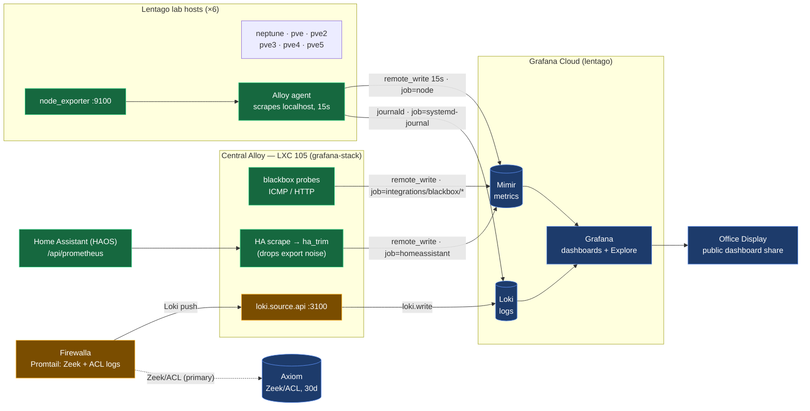
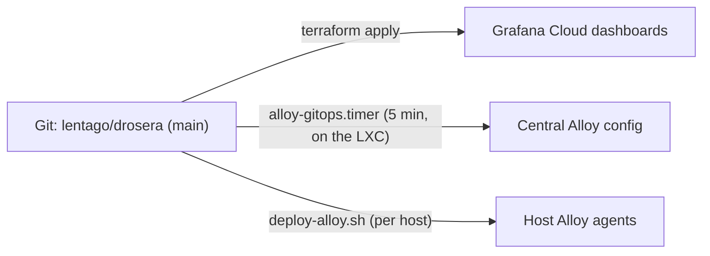

# Metrics & logs flow

How telemetry gets from the Lentago lab into Grafana Cloud, after the move to
**host-local Alloy push** for node metrics (see README §
"Collection models"). This is the canonical flow diagram, replacing an earlier hand-drawn diagram
from the pull-model era.

## The paths

**Node metrics (push).** Every host runs its own Alloy agent that scrapes the
local `node_exporter` on `127.0.0.1:9100` and `remote_write`s to Mimir every
15s, labelled `job="node"`, `instance="<host>"`. Hosts own and buffer their own
shipping; the central collector no longer pulls them. Deploy with
`scripts/deploy-alloy.sh`. *(Was: central Alloy scraped each host's `:9100` over
the LAN — replaced because it's tighter, buffers across blips, and scales.)*

**Blackbox probes (central).** The central Alloy runs ICMP/HTTP probes against
key LAN IPs + endpoints and `remote_write`s them as
`job="integrations/blackbox/<target>"`. Target list lives in
`alloy/config.alloy`.

**Home Assistant metrics (central).** The central Alloy scrapes HAOS's
`/api/prometheus`, routes it through the `ha_trim` relabel (drops ~5.8k series of
per-entity export noise — see README § "HA export trim"), and `remote_write`s
the rest as `job="homeassistant"`.

**Host logs (push).** Each host's Alloy agent also ships its **systemd journal**
to Grafana Cloud Loki via `loki.source.journal` → `loki.write` (`job="systemd-journal"`,
`host="<instance>"`, `cluster="lentago-lab"`; `level` and — for real `*.service`
units — `unit` are promoted as labels; debug-priority lines are dropped to bound
volume). Same push model as metrics; no central relay, no HA in the path. Added
by `scripts/deploy-alloy.sh`.

**Firewalla logs (security).** The Firewalla's Fluent Bit ships Zeek (DNS/conn/SSL)
and ACL logs to **Axiom** (primary, 30-day retention — high-volume security
logs). It also pushes to the central Alloy's `loki.source.api` on `:3100`
(→ `loki.write` → Cloud Loki) for live dashboards. *(Split by purpose: Loki =
host/infra ops logs, Axiom = high-volume security logs.)*

**Consumption.** Dashboards (Terraform-managed, `dashboards/*.json`) and Explore
read Mimir + Loki. The public **Office Display** is a shared dashboard.

## Label conventions

| Source | job | key labels |
|---|---|---|
| Host node_exporter (push) | `node` | `instance` ∈ {neptune, pve, pve2, pve3, pve4, pve5} |
| Blackbox probe | `integrations/blackbox/<target>` | — |
| Home Assistant | `homeassistant` | `entity`, `friendly_name`, `domain` |
| Host journald (Loki) | `systemd-journal` | `host`, `level`, `unit` (services only), `cluster="lentago-lab"` |
| Firewalla logs (Loki + Axiom) | `firewalla` | `log_source` ∈ {zeek_dns, zeek_conn, zeek_ssl, firewalla_acl}, `cluster="lentago-lab"` |

## Deploy flow (config → collectors)

- **Dashboards** → `terraform apply` (manual; CI plans on PR).
- **Central Alloy** → gitops pull loop on LXC 105 (`alloy-host/`), auto-deploys
  merged `main` within ~5 min.
- **Host agents** → `scripts/deploy-alloy.sh <instance>` per host (one-time;
  config is embedded in the script).
